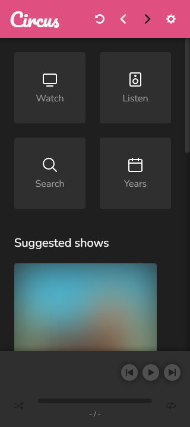
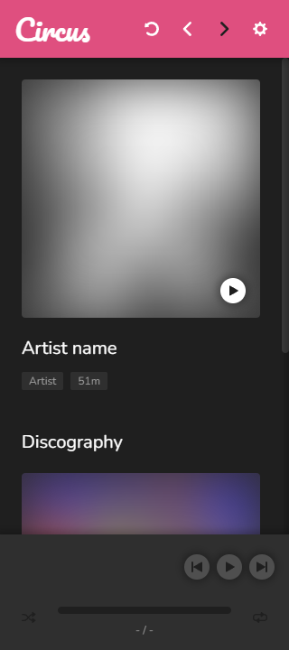
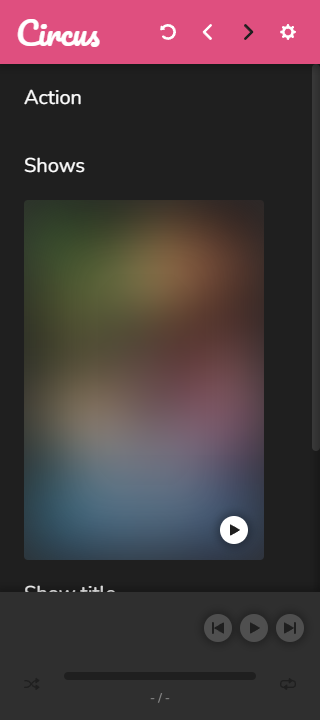
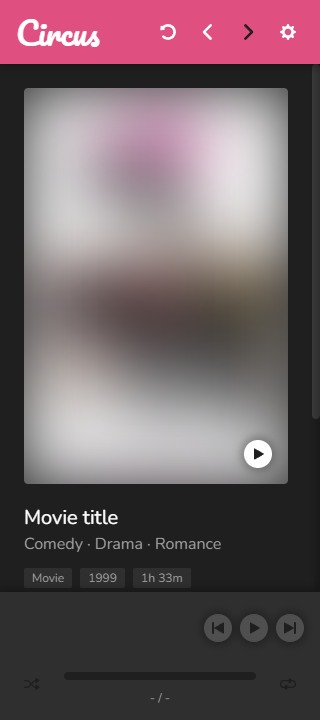
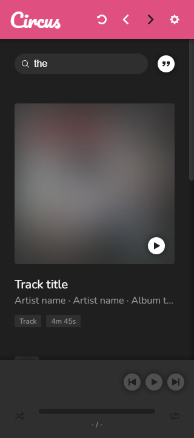
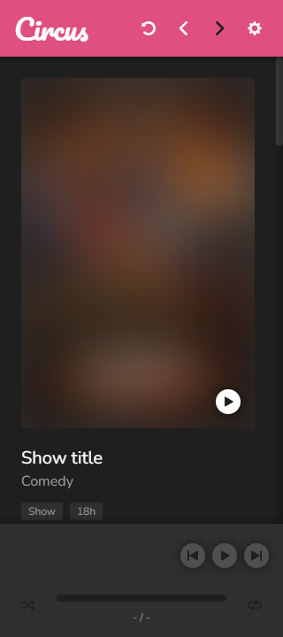
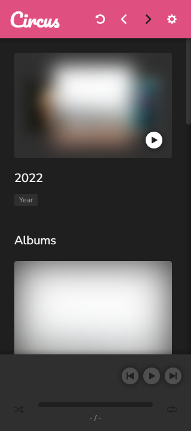

# @joelek/circus

System for streaming audio and video content.



> The start page.

## Device support

* Devices with a modern web browser
* Devices implementing the Cast protocol
* Devices implementing the AirPlay protocol

## Media support

### Playback

Circus delivers streaming media through HTTP range requests and as such, media support will essentially be determined by the device of the user. The following containers and stream formats are recommended for optimal support.

```
Audio: MP4 (AAC)
Video: MP4 (H264 + AAC)
```

### Indexing

Circus features a blazingly fast, custom engine for probing and indexing of content. The engine supports the file formats listed below.

* JPEG
* JSON
* MP3
* MP4
* VTT

Stream information and metadata is extracted from all supported files. The information is stored and indexed into a custom database system.

External image and metadata files may be used to supply additional information that cannot be stored within a specific container. The external metadata files must use one of the structures listed below.

```json
{
	"type": "episode",
	"title": "Episode title",
	"season": 1,
	"episode": 1,
	"year": 2000, // Optional
	"summary": "Episode summary.", // Optional
	"show": {
		"title": "Show title",
		"summary": "Show summary.", // Optional
		"genres": [
			"Genre name"
		],
		"actors": [
			"Person name"
		]
	}
}
```

```json
{
	"type": "movie",
	"title": "Movie title",
	"year": 2000, // Optional
	"summary": "Movie summary.", // Optional
	"genres": [
		"Genre name"
	],
	"actors": [
		"Person name"
	]
}
```

```json
{
	"type": "track",
	"title": "Track title",
	"disc": 1,
	"track": 1,
	"album": {
		"title": "Album title",
		"year": 2000, // Optional
		"artists": [
			{
				"title": "Artist name"
			}
		]
	},
	"artists": [
		{
			"title": "Artist name"
		}
	]
}
```

The media probing system associates metadata on a folder basis meaning that external image and metadata files associate with every media file contained in the same directory.

## Playback protocol

Circus features a custom playback protocol for playback and synchronization between devices. The protocol is simplistically designed and built using websocket technology.

## Installation

Circus can be installed on a wide range of server infrastructure since it's built almost entirely using NodeJS. Extra features become available when the FFMPEG tool suite is installed on the server.

Download the latest release package from https://github.com/joelek/circus/releases and unpack it. Advanced users may clone the repository using git and gain a convenient way of upgrading whenever new releases become available.

The server is started using `node .` and should ideally be configured to run automatically as a background service. The command launches an HTTP server on port 80 as well as an HTTPS server on port 443 if "full_chain.pem" and "certificate_key.pem" can be located in the "./private/certs/" directory.

Media files are indexed from the "./private/media/" directory. You need to either move your media files or create symbolic links if your media is located elsewhere.

Visit the domain or IP-address of the server in any web browser and register your user using the registration key displayed when launching the server. The registration key is consumed upon successful registration.

Circus technically supports multiple users although there is currently no way of generating additional registration keys. This will likely change in the future.

## Screenshots



> The page of an artist.



> The page of a genre.



> The page of a movie.



> The search page.



> The page of a show.



> The page of a year.

## Future plans

* Move playlist editing to context menu (fixes cache error).
* Create back and forward buttons for navigation.
* Add reload option for cached pages.
* Create typed REST API.
* Set document title based on page.
* Edit icons to look better in 12px.
* Export icons with 24px sizes.
* Create and use layout components with standard spacing.
* Put languages in database.
* Add offline functionality with service workers.
* Improve stream detection algorithm.
* Index generated images.
* Move authentication to typesockets.
* Add synchronization to playback protocol.
* Add shuffle and repeat features to player.
* Index content at regular one hour intervals when inactive.
* Add statistics page.
* Improve database performance. Only lookup records that are required.
* Verify external track metadata functionality.
* Add way of generating additional registration keys.
* Make ports and paths configurable.
